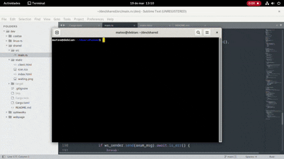

# shared

A **web solution developed in Rust** that allows one device on a shared network to **share its screen** with others. It is designed for pair programming and technical meetings within development companies, as well as for individual use The computer sharing its local screen acts as a **server** and streams a bitstream representing the pixels of the shared image to anyone who connects to the specified URL.

The program is designed so that **one screen** is shared with **multiple client devices**. There are two routes:

- At `/admin`, the user can share their screen with others.
- At `/`, users can view the screen being shared.


## Roadmap

* Features
   * [x] Share the screen
   * [ ] Optionally audio share
* OS Support (as a server)
   * [x] Linux
   * [x] Windows
   * [x] Mac

The program allows different administrators to share their screens within the same network using an algorithm that checks whether the current port (3000) is in use or not. If it is in use, it checks port 3001; if that is also in use, it checks port 3002, and so on.


## Execute

You can execute the latest shader version for x86_64 on Linux devices [here](https://github.com/mateolafalce/shared/releases).


## Compile and Run

You can run shared from scratch.

```bash
git clone https://github.com/mateolafalce/shared.git
```

```bash
cargo run
```

or 

```bash
cargo install path . 
```

```bash
shared
```

## Help

```bash
cargo run -- --help
```

or

```bash
shared --help
```

Output:

```bash
Options:
  -p, --port <PORT>    The port you want the program to run on, by default 3000
  -t, --title <TITLE>  The title of the page, by default "shared"
  -h, --help           Print help
  -V, --version        Print version
```

## Demo


